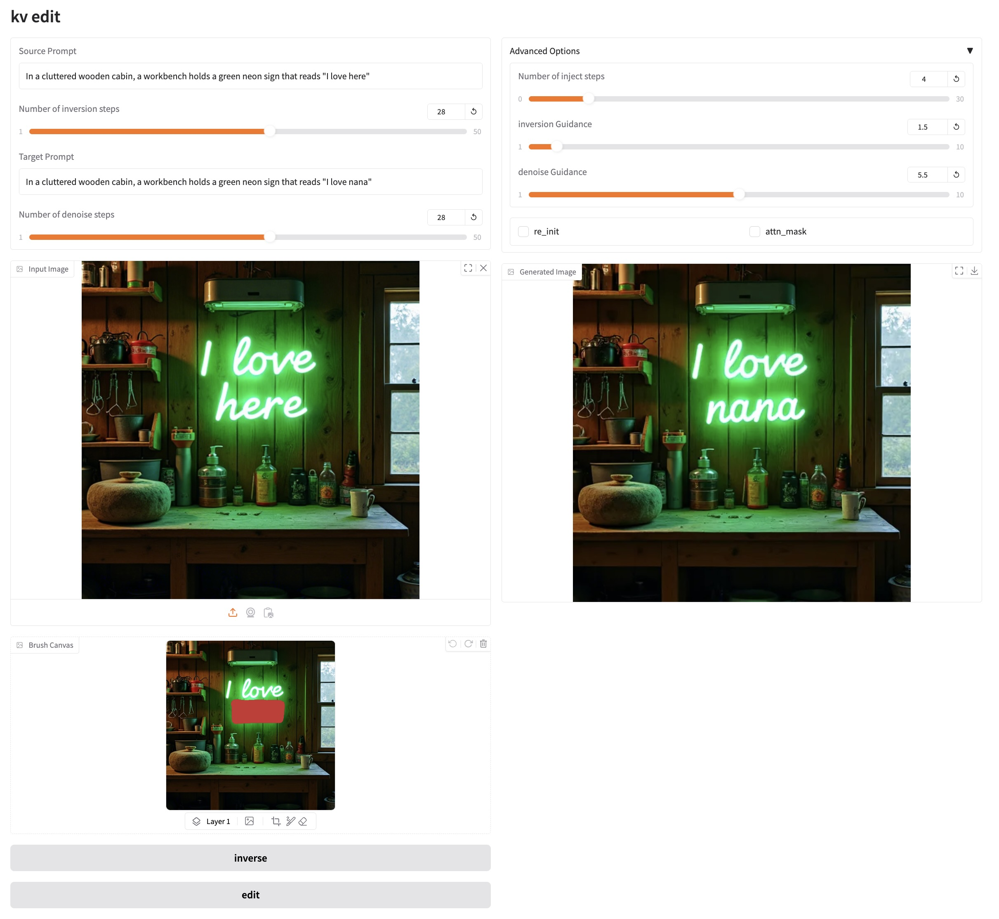

<div align="center">
  
# KV-Edit: Training-Free Image Editing for Precise Background Preservation

[Tianrui Zhu](https://github.com/Xilluill)<sup>1*</sup>, [Shiyi Zhang](https://shiyi-zh0408.github.io/)<sup>1*</sup>, [Jiawei Shao](https://shaojiawei07.github.io/)<sup>2</sup>, [Yansong Tang](https://andytang15.github.io/)<sup>1†</sup>

<sup>1</sup> Tsinghua University,  <sup>2</sup> Institute of Artificial Intelligence (TeleAI)


<a href='https://xilluill.github.io/projectpages/KV-Edit/'></a>
[](https://arxiv.org/abs/2502.17363)
[](https://huggingface.co/spaces/xilluill/KV-Edit) 
[](https://github.com/Xilluill/KV-Edit)

[](https://paperswithcode.com/sota/text-based-image-editing-on-pie-bench?p=kv-edit-training-free-image-editing-for)
</div>

<p>
We propose <strong>KV-Edit</strong>, a training-free image editing approach that strictly preserves background consistency between the original and edited images. Our method achieves impressive performance on various editing tasks, including object addition, removal, and replacement.
</p>


<p align="center">

</p>

# 🔥 News
- [2024.2.26] Our paper is featured in [huggingface Papers](https://huggingface.co/papers/2502.17363)!
- [2025.2.25] Code for image editing is released!
- [2025.2.25] Paper released!
- [2025.2.25] More results can be found in our [project page](https://xilluill.github.io/projectpages/KV-Edit/)!

# 👨‍💻 ToDo
- ☑️ Release the gradio demo
- ☑️ Release the huggingface space for image editing
- ☑️ Release the paper


# 📖 Pipeline
<p>

We implemented KV Cache in our DiT-based generative model, which stores the key-value pairs of background tokens during the inversion process and concatenates them with foreground content during denoising. Since background tokens are preserved rather than regenerated, KV-Edit can strictly maintain background consistency while generating seamlessly integrated new content.

# 🚀 Getting Started
## Environment Requirement 🌍
The environment of our code is the same as FLUX, you can refer to the [official repo](https://github.com/black-forest-labs/flux/tree/main) of FLUX, or running the following command to construct a simplified environment.

Clone the repo:
```
git clone https://github.com/Xilluill/KV-Edit
```
We recommend you first use conda to create virtual environment, then run:
```
conda create --name KV-Edit python=3.10
conda activate KV-Edit
pip install -r requirements.txt
```
## Running Gradio demo 🛫
We provide three demo scripts for different hardware configurations. For users with server access and sufficient CPU/GPU memory ( >40/24 GB), we recommend you use:
```
python gradio_kv_edit.py
```
For users with 2 GPUs(like 3090/4090) which can avoid offload models to accelerate, you can use:
```
python gradio_kv_edit_gpu.py --gpus
```
For users with limited GPU, we recommend you use:
```
python gradio_kv_edit.py --offload
```
For users with limited CPU memory such as PC, we recommend you use:
```
python gradio_kv_edit_inf.py --offload
```
Here's a sample workflow for our demo:

1️⃣ Upload your image that needs to be edited. <br>
2️⃣ Fill in your source prompt and click the "Inverse" button to perform image inversion. <br>
3️⃣ Use the brush tool to draw your mask area. <br>
4️⃣ Fill in your target prompt, then adjust the hyperparameters. <br>
5️⃣ Click the "Edit" button to generate your edited image! <br>

<div style="text-align: center;">
  
</div>

### 💡Important Notes:
- 🎨 When using the inversion-based version, you only need to perform the inversion once for each image. You can then repeat steps 3-5 for multiple editing attempts!
- 🎨 "re_init" means using image blending with noise instead of result from inversion to generate new contents.
- 🎨 When the "attn_mask" option is checked, you need to input the mask before performing the inversion.


# 🖋️ Citation

If you find our work helpful, please **star 🌟** this repo and **cite 📑** our paper. Thanks for your support!
```
@article{zhu2025kv,
  title={KV-Edit: Training-Free Image Editing for Precise Background Preservation},
  author={Zhu, Tianrui and Zhang, Shiyi and Shao, Jiawei and Tang, Yansong},
  journal={arXiv preprint arXiv:2502.17363},
  year={2025}
}
```

# 👍🏻 Acknowledgements
Our code is modified based on [FLUX](https://github.com/black-forest-labs/flux) and [RF-Solver-Edit](https://github.com/wangjiangshan0725/RF-Solver-Edit). Special thanks to [Wenke Huang](https://wenkehuang.github.io/) for his early inspiration and helpful guidance to this project!

# 📧 Contact
This repository is currently under active development and restructuring. The codebase is being optimized for better stability and reproducibility. While we strive to maintain code quality, you may encounter temporary issues during this transition period. For any questions or technical discussions, feel free to open an issue or contact us via email at xilluill070513@gmail.com.